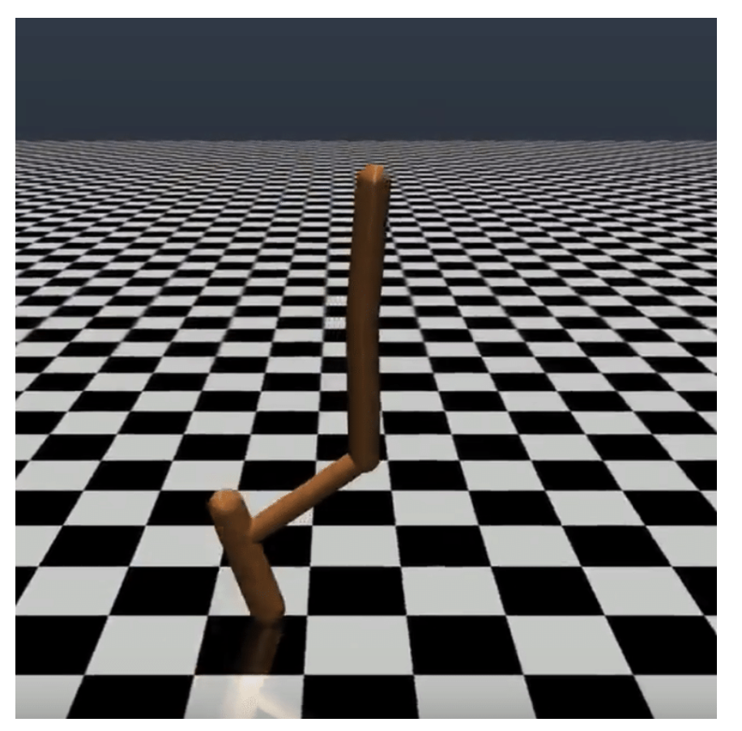

# Course Project - Advanced Machine Learning (AML) 2022
"Sim-to-Real transfer of Reinforcement Learning policies in robotics" exam project.

Authors: Federico Boscolo (s294908), Andrea D'Attila (s303339), Antonio De Cinque (s303503)

## Project Overview
This project focuses on applying state-of-the-art Reinforcement Learning (RL) techniques in the context of robot learning. The primary objective is to gain hands-on experience by developing control policies for robots within a simulation environment.

## Objectives
- **Sim-to-Real Transfer**: Address the challenge of transferring policies trained in a simulation to real-world robotic hardware. This aspect is crucial for ensuring that the theoretical models work effectively in practical, real-world scenarios.
- **Domain Randomization**: Implement Uniform Domain Randomization (UDR) to enhance the robustness of policies against variations between the simulated and real environments. This technique plays a vital role in minimizing performance degradation when transitioning from simulation to reality.

## Methodology
- **Control Policy Learning**: Utilize advanced RL algorithms to learn effective control strategies for a simulated robot.
- **Visual Input Integration**: Incorporate visual inputs by training control policies directly using Convolutional Neural Networks (CNNs). This approach leverages the power of visual data for more nuanced and adaptable robotic behavior.

## Implementation
The project will be carried out through a series of experimental setups where different RL algorithms and techniques will be tested and optimized for best performance in simulation. The insights and successful strategies will then be tested for their feasibility in real-world applications.

Below is a visual representation of the `hopper` robot model used in our simulations:

